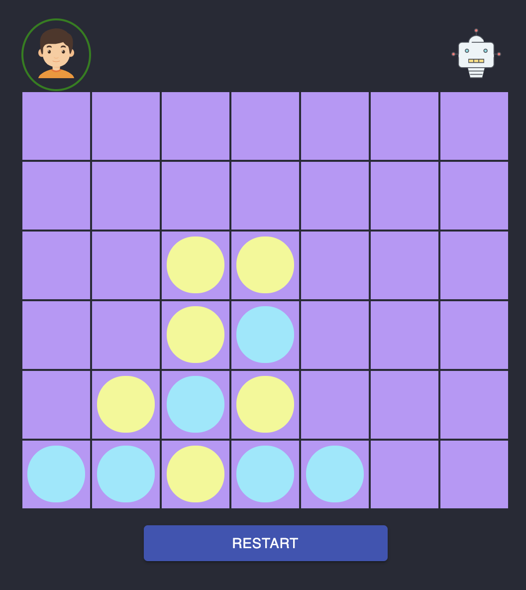

# ConnectFour

Connect Four is a two-player board game, in which the players choose a disk and then take turns dropping disks into a seven-column, six-row vertically grid. The game goal is to be the first player to form a horizontal, vertical, or diagonal line of four disks.

This project implements a strong `bot` to play this board game.

You can see the current game version [here](https://connectfour-ai.vercel.app/).

## Developing

### `yarn start`

Runs the app in the development mode. 
Open [http://localhost:3000](http://localhost:3000) to view it in the browser.
